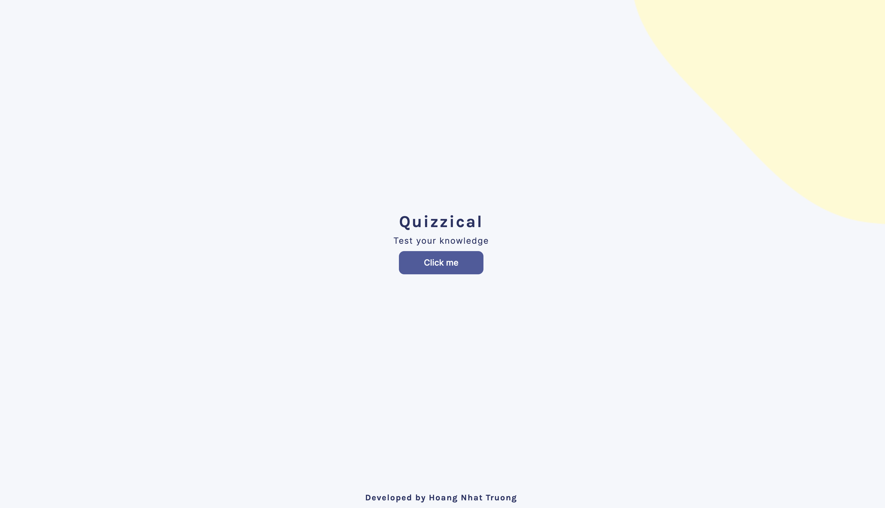

# QUIZ APP

**Project description**

The quiz app helps users to leverage their knowledge in a various categories.

## Table of content

- [Overview](#overview)
  - [Screenshot](#screenshot)
  - [Links](#links)
  - [My process](#my-process)
    - [What I learn](#what-i-learned)
- [Build with](#build-with)
- [Author](#author)
- [Acknowledgements](#acknowledgement)

## Overview

### Screenshot

### Links

- Solution URL: [Github](https://github.com/tin0312/quizApp)
- Live Site URL: [Netlify](https://unrivaled-sorbet-b6c280.netlify.app/)

### My process

### What I learned

1. Working with API with Async/Await functions.
2. Do it in a React way apply single responsibility principle.
3. How to use the useState hook and its functionalities.
4. Using useEffect hooks for asynchronous operations like fetching data from an external source, such as an API or database.

## Build with

- Sematic HTML5 markup.
- CSS customed properties.
- Flexbox
- [Bootstrap5](https://getbootstrap.com/docs/5.0/getting-started/introduction/)
- [React](https://react.dev/)
- JavaScript ES6+

## Author

- Hoang Nhat Truong
- Github: [@tin0312](https://github.com/tin0312)

- Twitter: [@justin_hppp](https://twitter.com/justin_hppp)

## Acknowledgement

- Design is credited to [Scrimba](https://scrimba.com/dashboard#overview)
